# PostgreSQL 17 Database Architecture — SG Trading Platform

## ERD

```mermaid
erDiagram
    TENANTS ||--o{ USERS : has
    TENANTS ||--o{ ROLES : has
    TENANTS ||--o{ API_KEYS : has
    TENANTS ||--o{ PORTFOLIOS : has
    TENANTS ||--o{ STRATEGIES : has
    TENANTS ||--o{ POSITIONS : has
    TENANTS ||--o{ ORDERS : has
    TENANTS ||--o{ TRADES : has
    TENANTS ||--o{ SIGNALS : has
    TENANTS ||--o{ RISK_EVENTS : has
    TENANTS ||--o{ ML_MODELS : has
    TENANTS ||--o{ ML_PREDICTIONS : has
    TENANTS ||--o{ AUDIT_LOGS : has
    TENANTS ||--o{ NOTIFICATIONS : has

    USERS ||--o{ API_KEYS : owns
    USERS ||--o{ USER_ROLES : has
    ROLES ||--o{ USER_ROLES : assigned
    ROLES ||--o{ ROLE_PERMISSIONS : has
    PERMISSIONS ||--o{ ROLE_PERMISSIONS : granted

    PORTFOLIOS ||--o{ POSITIONS : holds
    PORTFOLIOS ||--o{ PORTFOLIO_SNAPSHOTS : snapshots
    STRATEGIES ||--o{ ORDERS : generates
    STRATEGIES ||--o{ SIGNALS : emits
    STRATEGIES ||--o{ TRADES : attributed

    ORDERS ||--o{ TRADES : filled_by
    ML_MODELS ||--o{ ML_PREDICTIONS : produces

    USERS ||--o{ NOTIFICATIONS : receives

    TENANTS {
        uuid id PK
        string slug UK
        string status
        jsonb settings
        timestamptz deleted_at
    }

    USERS {
        uuid id PK
        uuid tenant_id FK
        string email
        string password_hash
        timestamptz deleted_at
    }

    ROLES {
        uuid id PK
        uuid tenant_id FK
        string name
        bool is_system
    }

    PERMISSIONS {
        uuid id PK
        string resource
        string action
        string scope
    }

    API_KEYS {
        uuid id PK
        uuid tenant_id FK
        uuid user_id FK
        string key_prefix UK
        string key_hash
        jsonb scopes
    }

    STRATEGIES {
        uuid id PK
        uuid tenant_id FK
        string name
        string version
        string status
        jsonb config
    }

    ORDERS {
        uuid id PK
        timestamptz created_at PK
        uuid tenant_id FK
        uuid portfolio_id
        string symbol
        string status
        string idempotency_key UK
    }

    TRADES {
        uuid id PK
        timestamptz executed_at PK
        uuid tenant_id FK
        uuid order_id
        timestamptz order_created_at
        numeric price
    }

    POSITIONS {
        uuid id PK
        uuid tenant_id FK
        uuid portfolio_id FK
        string symbol UK
        numeric quantity
        int version
    }

    PORTFOLIO_SNAPSHOTS {
        uuid id PK
        timestamptz snapshot_at PK
        uuid portfolio_id FK
        jsonb positions
    }

    MARKET_BARS {
        uuid id PK
        timestamptz bar_ts PK
        string symbol
        string timeframe
        numeric close
    }

    SIGNALS {
        uuid id PK
        timestamptz created_at PK
        uuid strategy_id FK
        string symbol
        string side
    }

    RISK_EVENTS {
        uuid id PK
        timestamptz created_at PK
        string event_type
        string severity
    }

    ML_MODELS {
        uuid id PK
        uuid tenant_id FK
        string name
        string version UK
        string status
    }

    ML_PREDICTIONS {
        uuid id PK
        timestamptz predicted_at PK
        uuid model_id FK
        jsonb prediction
    }

    AUDIT_LOGS {
        uuid id PK
        timestamptz created_at PK
        string action
        string resource_type
        jsonb old_values
        jsonb new_values
    }

    SYSTEM_EVENTS {
        uuid id PK
        timestamptz created_at PK
        string event_type
        string source_service
    }

    NOTIFICATIONS {
        uuid id PK
        uuid user_id FK
        string channel
        string status
    }
```



## Normalization Summary

| Level | Tables | Rationale |
|-------|--------|-----------|
| **3NF** | users, roles, permissions, strategies, portfolios, positions, ml_models | No transitive dependencies; junction tables for M2M |
| **Denormalized snapshot** | portfolio_snapshots.positions (JSONB) | Point-in-time immutable capture; avoids join explosion |
| **Denormalized reference** | trades.order_id + order_created_at | Partition-aware order linkage without cross-partition FK |
| **Shared dimension** | market_bars | Tenant-agnostic; symbols are global reference data |
| **Append-only** | audit_logs, system_events, trades | Immutable event streams |

## Partitioning Strategy

| Table | Partition Key | Strategy | Retention | Rationale |
|-------|---------------|----------|-----------|-----------|
| `orders` | `created_at` | RANGE monthly | 7 years | High write volume; time-scoped queries |
| `trades` | `executed_at` | RANGE monthly | 7 years | Compliance; P&L by period |
| `portfolio_snapshots` | `snapshot_at` | RANGE monthly | 3 years | Periodic captures |
| `market_bars` | `bar_ts` | RANGE monthly | 5+ years | Largest table; prune old months |
| `signals` | `created_at` | RANGE monthly | 1 year | Debug/audit; high volume |
| `risk_events` | `created_at` | RANGE monthly | 3 years | Compliance |
| `ml_predictions` | `predicted_at` | RANGE monthly | 1 year | High inference volume |
| `audit_logs` | `created_at` | RANGE monthly | 7+ years | Regulatory retention |
| `system_events` | `created_at` | RANGE monthly | 90 days | Operational telemetry |

**Partition management:** Cron job runs `sg_db.partitions.create_monthly_partitions()` 3 months ahead. Drop partitions past retention via `DROP TABLE orders_2020_01`.

**PK rule:** All partitioned tables use composite PK `(id, partition_key)` per PostgreSQL requirements.

## Index Plan

### Global Rules

1. **Tenant-first:** All tenant-scoped indexes lead with `tenant_id`.
2. **Partial indexes:** Active records use `WHERE deleted_at IS NULL`.
3. **Covering:** Hot dashboard queries use `INCLUDE` columns (add in phase 2).
4. **No over-indexing:** JSONB columns indexed via GIN only when queried.

### Index Catalog

| Table | Index | Type | Query Pattern |
|-------|-------|------|---------------|
| `users` | `(tenant_id) WHERE deleted_at IS NULL` | Partial B-tree | Active user listing |
| `users` | `UNIQUE (tenant_id, email)` | Unique | Login lookup |
| `api_keys` | `(key_hash)` | B-tree | API auth validation |
| `api_keys` | `(tenant_id, user_id) WHERE deleted_at IS NULL` | Partial | User key management |
| `strategies` | `(tenant_id, status) WHERE deleted_at IS NULL` | Partial | Active strategy list |
| `positions` | `(tenant_id, portfolio_id)` | B-tree | Portfolio holdings |
| `positions` | `UNIQUE (tenant_id, portfolio_id, symbol)` | Unique | Upsert position |
| `orders` | `(tenant_id, portfolio_id, status)` | B-tree | Open orders dashboard |
| `orders` | `(tenant_id, symbol, created_at DESC)` | B-tree | Symbol order history |
| `orders` | `(correlation_id)` | B-tree | Distributed trace lookup |
| `orders` | `UNIQUE (tenant_id, idempotency_key)` | Unique | Idempotent create |
| `trades` | `(tenant_id, portfolio_id, executed_at DESC)` | B-tree | Trade blotter |
| `trades` | `(tenant_id, order_id, order_created_at)` | B-tree | Order fill lookup |
| `market_bars` | `(symbol, timeframe, bar_ts DESC)` | B-tree | Backtest bar fetch |
| `market_bars` | `UNIQUE (symbol, exchange, timeframe, bar_ts)` | Unique | Upsert bars |
| `signals` | `(tenant_id, strategy_id, created_at DESC)` | B-tree | Strategy signal history |
| `risk_events` | `(tenant_id, portfolio_id, created_at DESC)` | B-tree | Risk dashboard |
| `risk_events` | `(tenant_id) WHERE resolved_at IS NULL` | Partial | Open violations |
| `ml_models` | `(tenant_id, status) WHERE deleted_at IS NULL` | Partial | Active models |
| `ml_predictions` | `(tenant_id, model_id, predicted_at DESC)` | B-tree | Model performance |
| `audit_logs` | `(tenant_id, created_at DESC)` | B-tree | Compliance audit |
| `audit_logs` | `(tenant_id, resource_type, resource_id)` | B-tree | Resource history |
| `notifications` | `(tenant_id, user_id) WHERE read_at IS NULL` | Partial | Unread count |

### Recommended Phase-2 Indexes

```sql
-- Dashboard open orders covering index
CREATE INDEX ix_orders_open_dashboard ON orders (tenant_id, portfolio_id, created_at DESC)
    INCLUDE (symbol, side, quantity, status, filled_quantity)
    WHERE deleted_at IS NULL AND status IN ('pending','submitted','partially_filled');

-- JSONB strategy config search
CREATE INDEX ix_strategies_config_gin ON strategies USING gin (config jsonb_path_ops)
    WHERE deleted_at IS NULL;

-- Audit log action filter
CREATE INDEX ix_audit_logs_action ON audit_logs (tenant_id, action, created_at DESC);
```

## Multi-Tenant Support

1. **`tenant_id` FK** on every tenant-scoped table with `ON DELETE CASCADE`.
2. **Row-Level Security (RLS):** `tenant_id = current_setting('app.tenant_id')::uuid`.
3. **Session setup:** `SET app.tenant_id = '<uuid>'` on every connection from API layer.
4. **Composite uniqueness:** `(tenant_id, email)`, `(tenant_id, name)` — no global collisions.
5. **API keys scoped** to tenant + user; `key_prefix` for O(1) lookup, `key_hash` for verification.

## Soft Deletes

| Table | Column | Query Pattern |
|-------|--------|---------------|
| tenants, users, roles, api_keys, strategies, portfolios, notifications | `deleted_at` | `WHERE deleted_at IS NULL` |
| orders | `deleted_at` | Cancelled orders retain row; soft delete for GDPR erasure |

**Rule:** Application repositories default-filter `deleted_at IS NULL`. Hard delete only for partition pruning.

## Audit Trails

| Mechanism | Scope |
|-----------|-------|
| `audit_logs` table | User/API actions on mutable resources (CRUD, deploy, kill switch) |
| Immutable tables | `trades`, `audit_logs`, `system_events` — no UPDATE/DELETE |
| `old_values` / `new_values` JSONB | Field-level change capture |
| `correlation_id` | Links audit → orders → trades → risk events |
| `positions.version` | Optimistic locking for concurrent fill updates |

## Query Optimization

### Connection Pooling

```
pool_size=20, max_overflow=10, pool_pre_ping=True, pool_recycle=3600
```

Use **PgBouncer** (transaction mode) in production between app and PostgreSQL.

### Query Patterns

```sql
-- ✅ Always filter tenant + time range on partitioned tables
SELECT * FROM orders
WHERE tenant_id = $1 AND created_at >= $2 AND created_at < $3
  AND deleted_at IS NULL
ORDER BY created_at DESC LIMIT 50;

-- ✅ Position upsert (optimistic lock)
UPDATE positions SET quantity = $1, version = version + 1, updated_at = now()
WHERE tenant_id = $2 AND portfolio_id = $3 AND symbol = $4 AND version = $5;

-- ✅ Market bar backtest load (partition pruning)
SELECT bar_ts, open, high, low, close, volume FROM market_bars
WHERE symbol = 'AAPL' AND timeframe = '5m'
  AND bar_ts >= '2025-01-01' AND bar_ts < '2026-01-01'
ORDER BY bar_ts;
```

### Anti-Patterns

- `SELECT * FROM orders WHERE id = $1` without `created_at` — scans all partitions.
- Joining `trades` → `orders` without `order_created_at` — use both keys.
- Unbounded queries on `signals` / `ml_predictions` — always time-bound.

## Performance Recommendations

| Area | Recommendation |
|------|----------------|
| **Hardware** | NVMe SSD; 64GB+ RAM; separate read replica for dashboard |
| **PostgreSQL config** | `shared_buffers=25% RAM`, `effective_cache_size=75% RAM`, `work_mem=64MB`, `maintenance_work_mem=1GB` |
| **Autovacuum** | Aggressive on `orders`, `trades` (scale_factor=0.02); `market_bars` parallel vacuum |
| **Monitoring** | `pg_stat_statements`, partition count, index bloat, replication lag |
| **Read replicas** | Dashboard API → replica; OMS writes → primary |
| **Archival** | Detach old partitions → `pg_dump` → S3 → `DROP TABLE` |
| **Market data scale** | >500M rows: migrate `market_bars` to TimescaleDB hypertable or ClickHouse |
| **Prepared statements** | Use SQLAlchemy `execution_options={"compiled_cache": "all"}` |
| **Batch inserts** | `COPY` / `insert().values([...])` for bars, predictions, signals |
| **RLS overhead** | Benchmark; consider schema-per-tenant for enterprise tier |

## Migration Workflow

```bash
cd database
pip install -e .
export DATABASE_URL=postgresql+psycopg://sg:sg@localhost:5432/sg_trading
alembic upgrade head
```

Monthly partition cron (new migration or script):

```bash
alembic revision -m "add_partitions_2028"  # then call create_all_partitions()
```

## File Locations

| Artifact | Path |
|----------|------|
| SQLAlchemy models | `database/sg_db/models/` |
| Alembic migrations | `database/alembic/versions/` |
| Partition helpers | `database/sg_db/partitions.py` |
| Session factory | `database/sg_db/session.py` |
